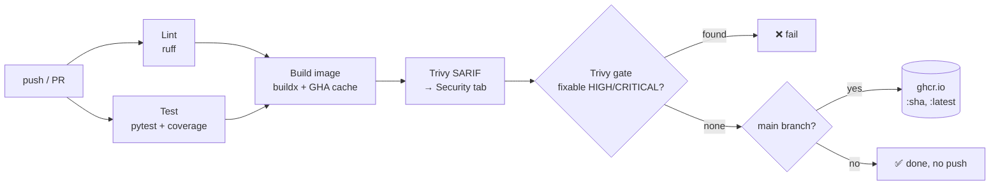

# Phase 3: Continuous Integration (GitHub Actions → ghcr.io)

## What was built

Every push to `main` that touches `app/`, `ci/` or the workflow runs a pipeline that
lints, tests, builds the container image, scans it with Trivy, and pushes it to
`ghcr.io/devanshlamba/mini-paas` tagged with the short commit SHA and `latest`.
Pull requests run the same checks but never push.



## Files

| File | What and why |
|---|---|
| `.github/workflows/ci.yml` | The pipeline: three jobs, least-privilege permissions, SHA-pinned actions, concurrency cancellation, timeouts |
| `ci/README.md` | How to run the same lint, test and scan checks locally before pushing |
| `app/Dockerfile` (changed) | Removed pip from the image and applied Debian security updates, which fixed the first Trivy findings. `APP_VERSION` declared late to keep the layer cache |

## Jobs

| Job | What it does | Why |
|---|---|---|
| **Lint** | `ruff check` (inline PR annotations) and `ruff format --check`. Installs only ruff, at the version pinned in `requirements-dev.txt` | Fast feedback (~15 s). One source of truth for tool versions |
| **Test** | `pytest -W error` with coverage. Uploads `coverage.xml`, the HTML report and JUnit XML as an artifact (kept 14 days) | Warnings fail the build, so deprecations are caught early. The artifact shows exactly what's untested |
| **Build, scan, push** | Runs only after lint and test pass. Builds once and loads the image locally. Trivy writes a full SARIF report, then a second Trivy pass gates on fixable HIGH/CRITICAL. On `main` only: log in with `GITHUB_TOKEN` and `docker push` both tags | The bytes that were scanned are the bytes that get pushed. No PR, including from a fork, can publish an image |

## Security choices

- **`permissions: {}` at the top, granted per job.** Lint and test get `contents: read`
  only. Just the build job gets `packages: write` (to push) and `security-events: write`
  (for SARIF). A compromised test dependency can't publish images.
- **`persist-credentials: false` on checkout.** The git token isn't left on disk for later
  steps to read.
- **`GITHUB_TOKEN`, not a personal access token.** It's short-lived (expires with the job),
  scoped to this repo, and there's no secret to rotate or leak.
- **Every action pinned to a full commit SHA** (with the version in a comment). Tags can
  be moved: in March 2026, attackers re-pointed `aquasecurity/trivy-action` tags at
  malicious code. A SHA can't be re-pointed. trivy-action v0.36.0 is a verified commit
  published after that incident, and it pins its own nested actions by SHA.
- **Validated by tools.** `actionlint` 1.7.12 (syntax and expressions) and `zizmor` 1.30.1
  (GitHub Actions security audits). zizmor's online audits confirm each pinned SHA really
  belongs to the claimed repository (no "impostor commits"). Both report no findings.
- **The Trivy version is pinned too** (`v0.74.0`, not the action's default). v0.75.0 came
  out the same day this was written; waiting a few days before adopting a security tool's
  newest release is cheap supply-chain hygiene.
- **The gate uses `ignore-unfixed`.** Failing on vulnerabilities nobody can fix yet would
  keep the build red forever and train people to ignore it. Unfixed ones still show up in
  the Security tab through SARIF.
- **Push only on `main`**, and the image is public, so the cluster needs no pull secret.
  The package inherited the repo's public visibility because the repo's own workflow
  published it, and the `org.opencontainers.image.source` label links it to the repo.

### What Trivy found, and the fix

The first local scan (before any push) failed the gate with **11 fixable HIGH** findings:

| Where | Packages | Fix |
|---|---|---|
| pip's vendored libraries (in the venv *and* the system Python) | `msgpack`, `urllib3` | The app never installs packages at runtime, so **pip is uninstalled from the image**. That fixes the CVEs and removes a tool an attacker could use |
| Debian OS packages | `openssl`, `libssl3t64`, `libpcre2-8-0` | The fixes were published after the base image was built, so the runtime stage runs **`apt-get upgrade`** |

Tradeoff: `apt-get upgrade` makes builds slightly less reproducible (patch versions can
differ between builds). A pinned base tag plus a Trivy scan on every build keeps that
acceptable. Next step if needed: a distroless base, which has far fewer OS packages.

## Results (real runs)

| | Run 1 (cold cache), [`23c0517`] | Run 2 (warm cache), [`cbc04e2`] |
|---|---|---|
| Lint | 13 s | 18 s |
| Test | 20 s | 17 s |
| Build, scan, push | 1 m 41 s | **46 s** |
| └ Build image step | 29 s | **6 s** (GHA layer cache) |
| └ Trivy SARIF scan / gate | 17 s / 1 s | n/a |
| └ Push | 11 s | n/a |
| Whole run | 2 m 11 s | n/a |
| Result | ✅ success | ✅ success |

- **Trivy (Security tab, image `23c0517`):** 0 critical, 44 high, 57 medium, 60 low,
  2 unknown. **None have a fix available**, so the gate passes.
- **Image:** 53.3 MB compressed download, 185 MB unpacked. Runs as `10001:10001`. No pip.
- **Anonymous `docker pull ghcr.io/devanshlamba/mini-paas:23c0517`** with an empty Docker
  config succeeded. The container answered `/health` with `{"status":"ok"}` and
  `/` with `"version":"23c0517"`.

## Verify yourself

```bash
gh run list --workflow ci.yml --limit 3
gh run view --log-failed                      # if a run fails
docker pull ghcr.io/devanshlamba/mini-paas:latest
docker run --rm -p 8000:8000 ghcr.io/devanshlamba/mini-paas:latest
```

- **Actions tab:** green runs, and a `coverage-report` artifact on each run.
- **Security tab → Code scanning:** Trivy alerts under the `trivy-image` category.
- **Packages (repo sidebar):** `mini-paas`, Public.

## Interview talking points

- **Why scan in CI rather than only in the registry?** Shift-left: a vulnerable image is
  stopped before it's ever published, and the developer sees it in the PR.
- **Why two Trivy passes?** One records *everything* for visibility (SARIF). The other
  enforces a *policy*. Mixing them would either hide data or block on noise.
- **Why build once and push the loaded image?** Rebuilding to push could produce different
  bytes (a new base digest or new apt patches) than the ones that were scanned.
- **Why SHA tags and `latest`?** The SHA is immutable and traceable to a commit, which is
  what GitOps deploys (Phase 4). `latest` is just a convenience for humans.
- **Why a `paths` filter?** Docs-only commits don't burn CI minutes. More importantly,
  in Phase 4 CI will commit image-tag bumps to `deploy/`, and without the filter that
  commit would trigger CI again: an infinite loop.
- **Least privilege in CI:** jobs only get the token scopes they need. Supply-chain
  attacks (compromised actions or dependencies) are exactly why this matters.

[`23c0517`]: https://github.com/DevanshLamba/mini-paas/commit/23c0517
[`cbc04e2`]: https://github.com/DevanshLamba/mini-paas/commit/cbc04e2
