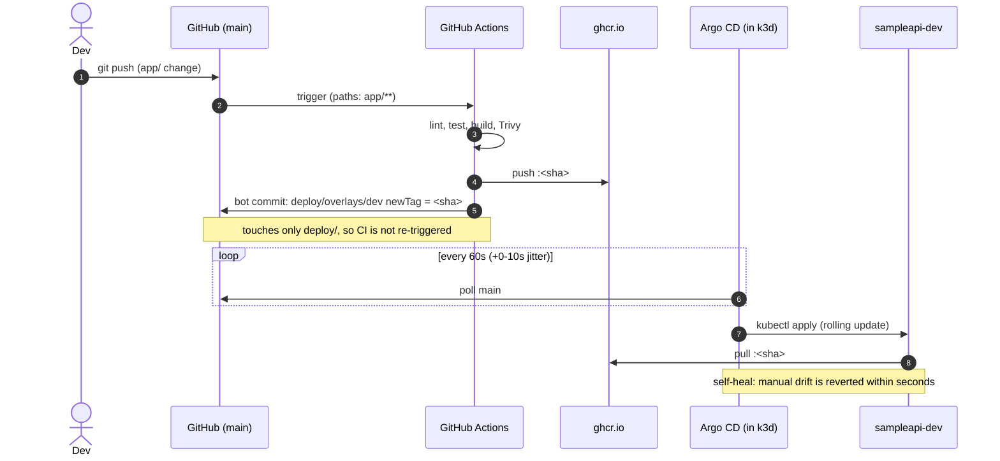

# Phase 4: GitOps with Argo CD

## What was built

Git is now the single source of truth for what runs in `sampleapi-dev`. CI never touches
the cluster. It publishes an image and commits the new tag to git, and Argo CD (running
*inside* the cluster) pulls that change and applies it. Argo CD also continuously undoes
any change made to the cluster by hand.



## Files

| File | What and why |
|---|---|
| `infra/helm-values/argocd.yaml` | Slim Argo CD (chart 10.9.6 / v3.5.3): one replica per component, Dex/notifications/ApplicationSet off, low requests and limits, 60 s git poll |
| `scripts/install-argocd.ps1` | Idempotent `helm upgrade --install` (pinned chart) plus registering the AppProject and Application |
| `deploy/argocd/project.yaml` | AppProject, the security boundary: one source repo, one destination namespace, an allowlist of resource kinds, warnings for resources created by hand |
| `deploy/argocd/sampleapi-dev.yaml` | Application: syncs `deploy/overlays/dev@main` with auto-sync, prune, self-heal, retry with backoff and cascading delete |
| `deploy/overlays/dev/kustomization.yaml` | Now points at `ghcr.io/devanshlamba/mini-paas`. Only CI's bot edits `newTag` |
| `deploy/overlays/local/` | The inner-loop overlay for `deploy.ps1` (namespace `sampleapi-local`, local registry, 1 replica). Not watched by Argo CD, so manual deploys and GitOps never fight |
| `scripts/deploy.ps1` (changed) | Targets the local overlay. Substitutes the tag at apply time, so no tracked file is modified |
| `.github/workflows/ci.yml` (changed) | New `update-manifests` job: commits the pushed SHA into the dev overlay as `github-actions[bot]` |

## Design decisions

- **Pull, not push.** CI has no kubeconfig and no cluster credentials at all. The cluster
  pulls its desired state from git, so a compromised CI pipeline can't reach the cluster.
  And because it's pull-based, a laptop cluster behind NAT works without any inbound access.
- **Only one job can write to the repo.** `update-manifests` is the only job with
  `contents: write`. It runs only on `main`, after the image has passed the Trivy gate.
  It waits its turn behind any other manifest update (`concurrency`). If the push is
  rejected, it rebases and retries. It never force-pushes.
- **No CI loop: the paths filter, not `[skip ci]`.** The bot's commit only touches
  `deploy/`, which CI's `paths` filter excludes. On top of that, GitHub never starts
  workflows for pushes made with `GITHUB_TOKEN`. `[skip ci]` was rejected because it skips
  *every* workflow, including a future manifest-validation workflow on `deploy/**`, for
  exactly the commits that most need it.
- **Polling, not webhooks.** GitHub can't reach a laptop. The poll interval was lowered
  from 120 s to 60 s (+10 s jitter), and that interval dominates the rollback timing below.
  With a public endpoint (e.g. a Cloudflare Tunnel in Phase 12), a webhook would make
  syncing near-instant.
- **The AppProject is least privilege.** Even if someone commits a ClusterRole or a
  Deployment into another namespace, Argo CD refuses to apply it. Later phases add kinds
  (HPA, ScaledObject, NetworkPolicy, ...) explicitly, as reviewed changes.
- **Image tags are commit SHAs.** Every pod can be traced to a commit, and a rollback is
  just an older SHA in git.

## Results (real runs, 2026-10-01)

| Scenario | What triggers it | Time to all pods Ready on the target image | Notes |
|---|---|---|---|
| **Push to new pods Ready** (`e7f43bc`, new `/version` endpoint) | `git push` of an app change | **179.5 s** | CI 138 s to the bot commit (lint 8 s ∥ test 25 s, build/scan/push 89 s, manifest commit 10 s). Argo CD noticed it 28 s later. The rollout took about 13 s |
| **Argo CD history rollback** (to `cbc04e2`) | `argocd app rollback sampleapi-dev 0` (auto-sync paused first) | **13.2 s** | Fastest option, but the app shows **OutOfSync**: git still says `e7f43bc` |
| └ re-enable auto-sync | `kubectl apply` of the Application | 8.9 s back to `e7f43bc` | Argo CD immediately undid the history rollback. Git wins |
| **`git revert` rollback** (to `cbc04e2`) | Revert of the bot commit `d4612ca`, push (a one-line diff) | **87.8 s** | No CI run (paths filter). The time is mostly Argo CD's polling interval. The rollout itself is about 10 s |
| **Self-heal** | `kubectl scale --replicas=5` | **1.5 s** | Argo CD watches live resources, so drift is reverted on the change event, not on the git poll. The 3 extra pods were created at 15:17:13 and deleted at 15:17:14 |
| Initial adoption | Registering the Application | 32.7 s | Argo CD took over the existing Deployment and rolled it to the ghcr.io image (includes the first image pull) |

Measured with a script that polls the Deployment once per second until every replica is
updated, ready and available on the target tag, with no old pods left. Times start at the
triggering command.

### Memory

| Component | Idle, no apps | Managing `sampleapi-dev` |
|---|---|---|
| application-controller | 30 MiB | 158 MiB |
| repo-server | 19 MiB | 45 MiB |
| server (UI/API) | 41 MiB | 33 MiB |
| redis | 5 MiB | 5 MiB |
| **Argo CD total** | **95 MiB** | **241 MiB** |

## Which rollback when?

| | `git revert` | Argo CD history rollback |
|---|---|---|
| Speed | Poll interval + rollout (~88 s here) | Rollout only (~13 s) |
| Durable? | Yes. Git and the cluster agree | No. It's undone as soon as auto-sync is back |
| Audit trail | A commit: who, when, why | Argo CD history only |
| Needs | Push access to the repo | Argo CD access, and auto-sync paused |
| Use for | **The normal way to roll back** | Break-glass during an incident, followed by a `git revert` |

## Open the Argo CD UI (for screenshots)

```powershell
# 1. Tunnel to the UI (leave this running in its own terminal)
kubectl -n argocd port-forward svc/argocd-server 8081:80

# 2. Read the initial admin password yourself (printed only in your terminal)
$b64 = kubectl -n argocd get secret argocd-initial-admin-secret -o jsonpath="{.data.password}"
[Text.Encoding]::UTF8.GetString([Convert]::FromBase64String($b64))
#    or, with the Argo CD CLI:  argocd admin initial-password -n argocd

# 3. Browse to http://localhost:8081 and log in as  admin / <password>
```

Good screenshots for the report: the **application tree** (Application → Deployment →
ReplicaSets → Pods), **History and Rollback** (the deployed revisions), and the
**sync status** banner showing `Synced / Healthy` with the commit SHA.

Hardening (Phase 10): change the admin password (`argocd account update-password`) and
delete `argocd-initial-admin-secret`.

### Argo CD CLI note (Windows)

Over `kubectl port-forward` on Windows, the CLI's gRPC (HTTP/2) connections were reset
and the tunnel exited. The browser UI (HTTP/1.1) works fine. The CLI is used in **core
mode** instead, which talks to the Kubernetes API directly and needs no tunnel or password:

```powershell
kubectl config set-context minipaas-argocd --cluster=k3d-minipaas --user=admin@k3d-minipaas --namespace=argocd
argocd app history sampleapi-dev --core --kube-context minipaas-argocd
```

## Verify yourself

```powershell
kubectl -n argocd get applications                 # sampleapi-dev  Synced  Healthy
kubectl -n sampleapi-dev get deploy sampleapi -o jsonpath="{.spec.template.spec.containers[0].image}"
argocd app history sampleapi-dev --core --kube-context minipaas-argocd
gh run list --workflow ci.yml --limit 3            # the revert and bot commits triggered no runs
kubectl -n sampleapi-dev scale deploy/sampleapi --replicas=5; kubectl -n sampleapi-dev get deploy sampleapi -w
```

## Interview talking points

- **GitOps in one sentence:** the desired state lives in git, and an in-cluster agent
  continuously makes reality match it. Every change is a reviewed, revertible commit.
- **Why separate CI and CD?** CI proves an artifact is good. CD decides where it runs.
  CI holds no cluster credentials, which removes the most valuable secret from the most
  exposed system.
- **Self-heal vs. a rollback being undone.** Both happen because Argo CD enforces git.
  That's why the durable rollback is a git revert, and why manual `kubectl` edits don't
  survive.
- **How do you avoid a CI loop when CI commits to the repo?** Path filters, and the
  `GITHUB_TOKEN` rule that doesn't trigger workflows. I chose path filters over `[skip ci]`
  and can explain why.
- **Least privilege across the chain:** one job with `contents: write`, an AppProject
  limiting repos, namespaces and kinds, and a namespace enforcing Pod Security `restricted`.
- **What dominates deploy latency?** Measured: CI (~138 s) more than polling (~28-80 s)
  more than the rollout (~13 s). Webhooks would remove the polling delay, and a slimmer
  image or a cached Trivy DB would shorten CI.
