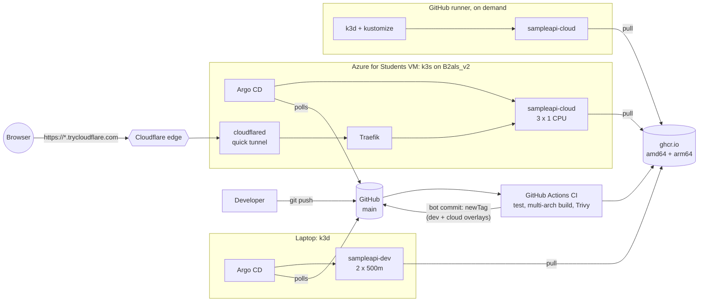

# Phase 4.5: A cloud environment with no credit card

> **Status:** code complete and tested offline. The Azure VM is **not yet created**: it
> waits for `az login` (done by you) and an approved `tofu plan`. Rows marked
> `⏳ PLACEHOLDER` are filled in only from real runs.

## Goal and constraints

Run the same app, the same GitOps setup and the same load test on a real cloud VM, next to
the laptop, using **only free or student credit and no credit card**.

| Option | Card needed? | Outcome |
|---|---|---|
| Oracle Cloud Always Free (Ampere A1, 2 OCPU / 12 GB) | **Yes, for signup verification** ("most users need a mobile phone number and a credit card") | Parked in [`infra/terraform/oci-unused/`](../../infra/terraform/oci-unused/), tested and ready but unused |
| **Azure for Students** ($100 credit, 12 months, school email) | **No** ("No credit card required") | **Chosen**: [`infra/terraform/azure/`](../../infra/terraform/azure/) |
| GitHub Actions ephemeral k3d cluster | No (free for public repos) | **Fallback**, already producing results: [`ephemeral-loadtest.yml`](../../.github/workflows/ephemeral-loadtest.yml) |

Azure for Students terms (official pages, checked 2026-10-01): $100 credit for 12 months, no
credit card. When the credit runs out or the year ends, the subscription is **cancelled,
not charged** (it can be renewed while you're a student). Deployments are restricted by
Azure Policy to **a handful of regions that differ per account**. `scripts/azure.ps1` reads
your allowed list and the plan refuses any other region.

## Architecture



## Files

| File | What and why |
|---|---|
| `infra/terraform/azure/versions.tf` | Pins `hashicorp/azurerm` to **5.7.0** (latest on 2026-10-01). Works with OpenTofu and Terraform |
| `infra/terraform/azure/providers.tf` | Auth via your `az login` session only. Deletes the OS disk on destroy. Registers only the core resource providers |
| `infra/terraform/azure/variables.tf` | **Guard rails:** VM size limited to three small burstable sizes, OS disk 30–64 GiB, SSH source must be a `/32`. Nightly auto-shutdown on by default |
| `infra/terraform/azure/main.tf` | Resource group (with an allowed-region precondition), VNet, subnet, NSG (22 from your IP, 80/443 open, 6443 explicitly denied), static public IP, NIC, Ubuntu 24.04 VM, auto-shutdown schedule |
| `infra/terraform/azure/cloud-init.yaml.tftpl` | Installs k3s **v1.36.5+k3s1** (the install script comes from the same pinned tag) with Secrets encrypted at rest. Traefik is kept as the single ingress |
| `infra/terraform/azure/outputs.tf` | Public IP, the SSH command, and the SSH tunnel for the (closed) Kubernetes API |
| `infra/terraform/azure/tests/guardrails.tftest.hcl` | 5 offline tests with a mocked provider: **5/5 on OpenTofu 1.13.0 and Terraform 1.16.4** |
| `infra/terraform/azure/.terraform.lock.hcl` | Provider checksums for Windows, Linux and macOS |
| `scripts/azure.ps1` | Runs `tofu` after **your** `az login`. Injects the subscription ID, allowed regions and your /32 as env vars, never printed or written to disk |
| `scripts/azure-destroy.ps1` | `tofu destroy` of everything (asks first) and checks that the resource group is gone. `-StopOnly` deallocates the VM instead |
| `deploy/overlays/cloud/` | Cloud environment: 3 replicas, 1 CPU / 256 Mi limits, host-less Traefik Ingress |
| `deploy/platform/quick-tunnel/` | cloudflared quick tunnel (digest-pinned, non-root, read-only). Outbound-only, no Cloudflare account |
| `deploy/argocd/cloud/` | `mini-paas-cloud` AppProject plus Applications for the app and the tunnel |
| `scripts/install-argocd.ps1` (changed) | `-KubeContext` / `-AppsPath`: the same slim Argo CD values on any cluster |
| `loadtest/k6/scenario.js` | The shared scenario: constant arrival rate of 20 → 60 → 120 req/s, 60 s each, with per-step metrics |
| `loadtest/k6/job.yaml`, `namespace.yaml` | Runs k6 **inside** the cluster (digest-pinned image, restricted Pod Security) |
| `loadtest/run-k6-job.sh` | Runs the Job and saves environment metadata plus the k6 summary to `loadtest/results/*.json` |
| `.github/workflows/ephemeral-loadtest.yml` | The fallback: k3d on a GitHub runner, kustomize deploy, k6, results artifact. `contents: read` only |
| `.github/workflows/ci.yml` (changed) | The bot now bumps **both** the dev and cloud overlays |
| `infra/terraform/oci-unused/` | The parked Oracle work, with a README explaining why |

## Design decisions

- **Why B2als_v2?** It's the cheapest size that fits k3s plus Argo CD. The laptop measured
  ~1.1 GiB for k3s and 241 MiB for Argo CD, so the free-tier B2ats_v2 (1 GiB RAM) would
  swap constantly. B-series sizes are *burstable*: under sustained load they run down CPU
  credits and drop to a baseline share of the vCPUs. That's worth knowing when reading
  the load-test numbers.
- **Kubernetes API never public.** The NSG denies 6443 explicitly. `kubectl` reaches the API
  through `ssh -L 16443:127.0.0.1:6443`, with SSH allowed from one /32 only.
- **Traefik kept in the cloud (disabled locally).** In the cloud, one ingress serves both
  the public IP and the tunnel. Locally, port-forward is enough.
- **Quick Tunnel, not a public port, for sharing.** The connection is outbound only, the
  HTTPS certificate comes from Cloudflare, and no account or domain is needed. Tradeoffs: a
  random URL that changes on restart, no uptime guarantee, and it's meant for testing. So
  it serves the demo link, **not** the load test.
- **k6 runs inside each cluster.** Running it through the tunnel or over the internet would
  measure Cloudflare and home Wi-Fi. A k6 Job next to the Service makes the clusters
  comparable.
- **CI follows main in both overlays.** Each overlay stays self-contained and explicit. A
  promotion step (dev → cloud only after checks) is a natural next improvement.

## Credit estimate (Azure Retail Prices API, `centralindia`, USD, 2026-10-01)

| Item | Price | Per day running |
|---|---|---|
| VM `Standard_B2als_v2` (2 vCPU / 4 GiB), Linux | $0.0338 / hour | **$0.81** |
| Standard static public IPv4 | $0.005 / hour | $0.12 |
| OS disk Standard SSD E4 (32 GiB) | $2.64 / month | $0.09 |
| **Total, VM running 24 h** | | **≈ $1.02 / day** (the $100 credit lasts ~98 days) |
| VM deallocated (`azure-destroy.ps1 -StopOnly`, or the nightly auto-shutdown) | IP + disk only | ≈ $0.21 / day |
| **Destroyed** (`azure-destroy.ps1`) | nothing left | **$0.00** |

Prices vary by region (B2als_v2 is $0.0622/h in `southindia`, almost double). The final
estimate is recalculated for the region your policy allows when the plan is run.
`⏳ PLACEHOLDER`: actual credit used, read from the Azure Sponsorships portal after the test.

## Load test results (real runs)

Same k6 scenario everywhere: `/work?iterations=20000` (≈ 9–10 ms of CPU per request), constant
arrival rate, 60 s per step, k6 running as an in-cluster Job. Raw JSON in
[`loadtest/results/`](../../loadtest/results/).

| Environment | Hardware | App config | Step (req/s) | Achieved | p50 ms | p95 ms | p99 ms | Failed | Restarts |
|---|---|---|---|---|---|---|---|---|---|
| Laptop k3d (dev overlay) | 2 nodes × 4 CPU (Docker VM), 4 GiB | 2 × 500m | 20 | 20.0 | 12.3 | 13.2 | 16.6 | 0 % | |
| | | | 60 | 60.0 | 10.6 | 12.4 | 80.2 | 0 % | |
| | | | **120** | **81.2** | **3,681** | **9,291** | **10,000** | **7.2 %** (2,325 dropped) | **2** |
| Laptop k3d (cloud overlay) | same | 3 × 1 CPU | 20 | 20.0 | 12.3 | 13.2 | 14.3 | 0 % | |
| | | | 60 | 60.0 | 10.6 | 11.6 | 12.8 | 0 % | |
| | | | 120 | 120.0 | 12.8 | 22.3 | 26.9 | 0 % | 0 |
| GitHub runner k3d (cloud overlay) | 2 nodes × 4 vCPU, 16 GiB | 3 × 1 CPU | 20 | 20.0 | 11.3 | 11.9 | 15.4 | 0 % | |
| | | | 60 | 60.0 | 11.0 | 12.0 | 14.1 | 0 % | |
| | | | 120 | 120.0 | 22.6 | 45.9 | 60.0 | 0 % | 0 |
| **Azure B2als_v2 k3s (cloud overlay)** | 1 node × 2 vCPU, 4 GiB | 3 × 1 CPU | 20 / 60 / 120 | `⏳ PLACEHOLDER` | `⏳` | `⏳` | `⏳` | `⏳` | `⏳` |

What the real numbers show so far:

1. **Configuration mattered more than hardware.** On the same laptop, the dev overlay
   (2 × 500m) collapsed at 120 req/s. It managed only 81 req/s, p50 was 3.7 s, and 7.2% of
   requests failed. The cloud overlay (3 × 1 CPU) served the full 120 req/s at p95 22 ms.
   The ceiling was the CPU *limit*, not the machine.
2. **Liveness probes killed busy pods.** Under saturation, `/health` couldn't answer within
   2 s, so the kubelet restarted 2 containers in the middle of the test and made the
   overload worse. That's the motivation for Phase 6 (autoscaling) and for loosening
   liveness timings.
3. **Same manifests, different CPUs.** The GitHub runner's p95 at 120 req/s (46 ms) is about
   twice the laptop's (22 ms) with identical manifests: shared cloud vCPUs are slower per
   request than the laptop's cores.

## Runbook

```powershell
az login                                         # you, in the browser
.\scripts\azure.ps1 init
.\scripts\azure.ps1 plan -out tfplan             # review the resources and credit estimate
.\scripts\azure.ps1 apply tfplan                 # only after approval
# ... Argo CD, quick tunnel, k6 (see "after apply" below)
.\scripts\azure-destroy.ps1                      # stop ALL credit use; checks the RG is gone
```

Fallback with no account at all: **Actions → Ephemeral cluster load test → Run workflow**,
then download the `k6-results-*` artifact.

### State: where it lives and the risks

State is a local file, `infra/terraform/azure/terraform.tfstate` (gitignored).

- **If the file is lost,** OpenTofu no longer knows the VM exists. The VM keeps using
  credit, and you'd have to import it or delete the resource group by hand
  (`az group delete -n minipaas-rg`). Keep a copy of the file somewhere safe.
- **There's no locking,** so two runs at once could corrupt it.
- **It contains infrastructure details** (public IP, resource IDs) in plain text. It
  holds no passwords here, because authentication is your CLI session.
- **The upgrade path** is the `azurerm` backend in an Azure Storage account, which has
  locking and is encrypted at rest. It costs a few cents a month, so it's deferred for a
  single-operator project.

## Interview talking points

- **Constraints drive architecture.** "No card" ruled out Oracle and pointed to Azure for
  Students, plus an account-free fallback on CI runners. I didn't wait for a perfect
  environment; I made the benchmark portable.
- **Guard rails as code.** Variable validations and preconditions make a costly or
  insecure plan *fail*. Mocked-provider tests prove the guard rails work without any
  cloud account.
- **Measure, then explain.** The benchmark separated configuration (CPU limits) from
  hardware (runner vs. laptop) by running the same manifests in different places.
- **Supply chain end to end.** A multi-arch image is built once, scanned and smoke-tested
  per architecture, then copied by digest. Every action, image and binary is pinned and
  checksum- or digest-verified.
